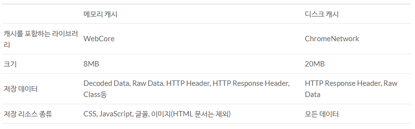
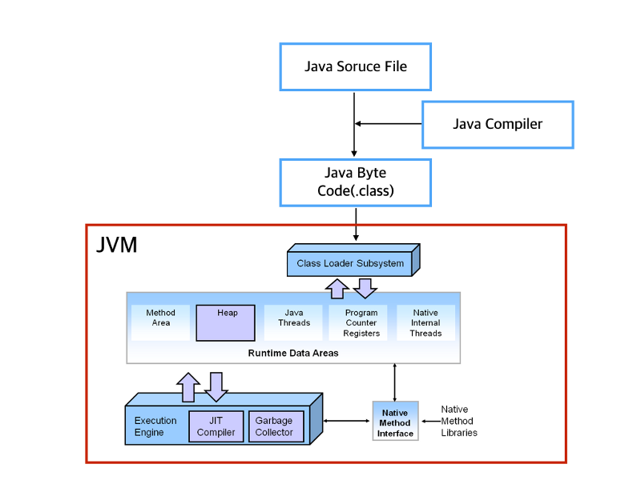
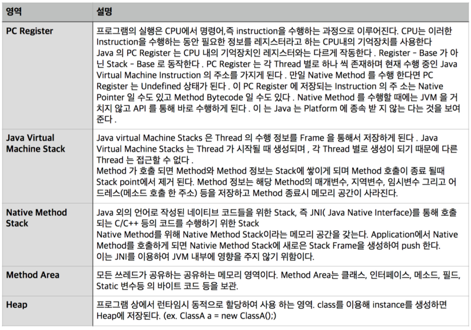
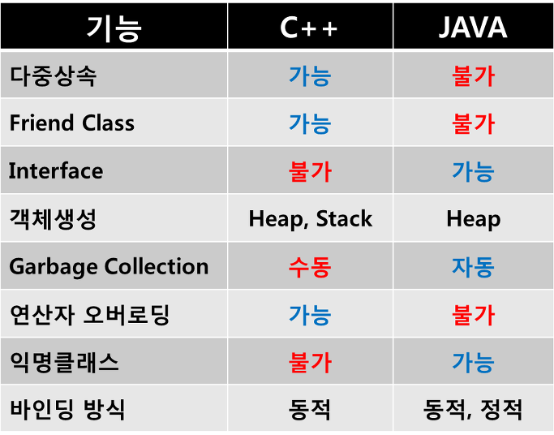

정리가 덜 된 포스트입니다. 지속적으로 추가할 예정입니다.

## Network
---
- 이더넷이란 `LAN`에서 가장 많이 활용되는 네트워크 기술 규격이다. 인터넷을 도로라면, 이더넷은 교통으로 볼 수 있다.

## DB
---
### DDL, DML, DCL

### inner join, outer join, Unique...
`Nested Loop Join`은 중첩 반복을 사용하는 조인 알고리즘이다. 실행 순서는 다음과 같다.
1. Table A에서 로우를 하나씩 반복해가며 스캔한다. 이 테이블을 `Driving Table` 혹은 `Outer Table`이라 한다.
반대편 테이블은 `Inner Table`이라 한다.
2. Driving Table의 로우 하나마다 Inner Table의 레코드를 스캔하며 Join 조건에 맞으면 리턴한다.
3. 1~2 과정을 Driving Table의 모든 로우에 반복한다.

이겨서 로우가 적은 테이블을 Driving Table로 설정하고, Inner Table의 조인키는 인덱스가 있어야 성능이 좋아진다.

`Outer Join`은 `(+)`가 선언된 테이블의 반대편에 있는 로우 중 조건에 맞는 것들은 모두 출력되는 조인이다.
> `(+)`의 반대쪽이 Driving Table이고, 오라클 외의 다른 DB에서는 `LEFT/RIGHT OUTER JOIN` 등으로 Driving Table을 지정할 수 있다.

### index, composite index
`인덱스(Index)`란 지정한 칼럼을 기준으로 메모리 영역에 일종의 목차를 생성하는 것이다.

`insert`, `delete`, `update`의 성능을 희생하고 `select(Query)`의 성능을 향상시킨다.
> update, delete 행위가 느린것이지, update, delete를 하기 위해 해당 데이터를 조회하는것은 빠르다.

인덱스는 크게 **해시 인덱스**와 **B+Tree 인덱스**로 구분된다.

해시 인덱스는 키 값을 해시 값으로 변경하고 해시 값 + 값의 구조를 가진다.
해시 계산의 경우 데이터 양에 의존하지 않기에 항상 `O(1)`의 성능을 가진다. 그러나 아래와 같은 경우에는 전혀 사용할 수 없다.
- 최신순으로 정렬된 값을 찾는 경우
- 가격이 N 이하인 상품을 찾는 경우
- 제목이 A로 시작하는 상품을 찾는 경우

이러한 단점을 보완한 것이 B+Tree 인덱스 구조이다. 인덱스는 3개의 노드 타입으로 분류된다.
1. Root Node
    - 최상위 노드이고, 하위 브랜치 노드 수만큼 로우를 가지고 있다.
2. Branch Node
    - Root와 Leaf Node를 연결한다. 자신의 하위 Leaf Node 수 만큼의 로우를 갖고 있다.
    - 데이터가 적을 경우 Root Node + Leaf Node만 구성될 수 있다. 반대의 경우 Branch Node 아래 Branch Node가 추가될 수 있다.
3. Leaf Node
    - Key와 RowID로 구성된다. RowID는 해당 테이블 로우를 찾기 위한 주소이다.
    - Key 순으로 정렬되어 있으며, 이전 이후의 Leaf Node Key를 갖고 있다.

Data Block은 Leaf Node의 RowId가 가리키는 테이블 로우의 실제 저장소를 말한다.

인덱스 탐색은 Root, Branch, Leaf, 디스크 저장소 순으로 진행된다.

#### 주의사항
- 범위 조건(`between`, `like`, `<`, `>`)은 사용하면 안 된다

- `=`, `in`은 다음 칼럼도 인덱스를 사용한다. 그러나 `in`은 인자값으로 서브 쿼리를 넣게되면 성능 이슈가 발생한다.

- `OR` 연산자는 비교해야할 로우가 더 늘어나기 때문에 풀 테이블 스캔이 발생할 확률이 높다.

- 인덱스로 사용된 컬럼값 그대로 사용해야만 인덱스가 사용된다.
> `where A * 10 > 100;`는 인덱스를 사용하지 못하고, `where A > 100 / 10`은 인덱스를 사용할 수 있다.

- `null`을 비교값으로 사용한 경우엔 인덱스를 타지 않습니다.

- Distinct가 낮은 순으로 인덱스를 생성하는 것이 유리하다.

- 단일 칼럼으로 인덱스를 만들어야 한다면, Distinct가 높을수록 유리하다.

**모든 요청을 캐시할 수 없는 서비스에서 DB가 특히 중요하다.**

### NoSQL
단순 검색 및 추가 작업을 위해 최적화된 Key-Value 저장 공간이다. Latency, Throughput 관련해서 성능 이익을 내는 것이 목적이다.

빅데이터와 실시간 웹 애플리케이션에서 많이 사용된다.

### Memcached & Redis
In-Memory 저장소이다. 데이터가 메모리에만 저장되므로 속도가 빠르며, 프로세스가 죽거나 장비 셧다운 시 데이터가 사라진다.
만료일을 지정하여 데이터를 삭제할 수 있고, 더 이상 데이터를 넣을 메모리가 없으면 `LRU` 알고리즘에 의해 데이터가 사라진다.

보통 Static Page, 검색 결과, 로그인 등을 캐시하는데 사용된다.

## OS
--
### ALU(Arithmetic Logic Unit)
산술논리장치를 말한다. 

### 레지스터

### 메모리 영역 4가지

### Polling, Long-Polling, Web-Socket

### Blocking, Non-Blocking, Synchronous, Asynchronous
1. `Blocking`
    - 애플리케이션 실행 시 운영체제 대기 큐에 들어가고, 요청에 대한 **System Call**이 완료 된 후에 응답을 보낸다.
    > 시스템 호출(System Call)이란, 애플리케이션의 요청에 따라 커널에 접근하기 위한 인터페이스이다.
    - 시스템의 반환을 기다리는 동안 대기 큐에 머무는 것이 필수이다.
2. `Non-Blocking`
    - 애플리케이션 실행 시 운영체제 대기 큐에 들어가지 않고, 실행 여부와 상관없이 바로 응답을 보낸다.
    - **System Call**이 반환될 때, 실행된 결과와 함께 반환된다.
    - 요청에 대해 바로 응답할 수 있는 경우 응답하고, 아니면 에러를 반환한다. 만약 에러를 받는다면 계속해서 요청을 다시 보낸다.
    > `Polling` 방식의 구조를 생각하면 된다.
3. `Synchronous`
    - **API Call**을 보낸 후 응답을 받을 때까지 대기하고, 응답을 받은 후 종료된다.
    - 시스템의 반환을 기다리는 동안 대기 큐에 머무는 것이 필수가 아니다.
4. `Asynchronous`
    - **API Call**을 보낸 후 실행 여부와 상관없이 바로 응답을 받는다.
    - **System Call**이 반환될 때, 실행된 결과와 함께 반환되지 않는다.
    - 요청에 대한 처리 완료 여부와 상관없이 바로 응답한다.

### 뮤텍스 세마포어
- slideshare 참고

## 용어 정리
---
### Round Trip
클라이언트(브라우저)가 웹 서버로 리소스를 요청하고, 응답을 받아 HTML, CSS를 파싱하여 렌더링하는 일련의 주기를 `Round Trip`이라 한다.

### Session, Cookie, Cache
1. Cookie
클라이언트의 정보를 PC의 보조기억장치에 보관하고자 웹 사이트에서 클라이언트의 브라우저로 전송하는 정보를 말한다.
특정 웹 사이트를 얼마나 자주 방문했는지, 어떤 키워드를 검색했는지에 대한 정보가 그 예이다. 웹 서버에서 유저를 식별하기 위한 **Session Tracking**의 방법으로 사용한다.

쿠키 정보는 오직 해당 쿠키를 작성한 웹 서버만이 접근 가능하다. 쿠키는 만료일 포함 여부에 따라 두 가지로 분류된다.
- **영구 쿠키**는 만료일이 포함되어 있는 쿠키이다. 브라우저를 종료해도 사용자 보조기억장치에 저장되고, 만료 시기가 되면 삭제 된다.
- **세션 쿠키**는 만료일이 포함되어 있지 않은 쿠키이다. 메모리에 저장되며, 브라우저를 닫는 순간 서버에서 만료되어 영구적으로 삭제 된다.
Session Tracking에서 세션 ID를 운반할 때 사용된다.

쿠키는 사용자가 따로 요청하지 않아도 브라우저가 요청을 보낼 때, 헤더에 자동으로 포함되어 서버에 전송된다. 또한, `Domain`, `Path` 속성으로 스코프를 정의할 수 있다.

2. Session
일정 시간동안 같은 사용자로부터 들어오는 요청을 하나의 상태로 보고 유지시키는 기술이다. 즉, 사용자가 웹 서버에 접속해 있는 상태를 하나로 보고 세션이라 한다.

세션은 서버 쪽에 사용자 정보를 저장하고, 세션은 각 클라이언트에게 고유의 ID를 부여한다. 이를 세션 ID라고 부른다.
서버에서는 클라이언트로 발급해준 세션 ID를 쿠키를 사용하여 저장한다. 만약 클라이언트가 다시 접속하면, 이 세션 쿠키를 사용하여 세션 ID값을 서버에 전달한다.
> JSP의 경우 `JSESSIONID`로 Session Token이 생성된다.

쿠키와 세션의 차이점은 다음과 같다.
- 쿠키는 로컬에 파일로 저장되고, 세션은 서버에 저장된다.
- 쿠키에 정보가 저장되어 있어서 서버 요청 시 쿠키가 상대적으로 빠르다.
- 세션은 쿠키를 이용하여 세션 ID만을 저장하여 사용하기에 상대적으로 쿠키보다 보안성이 좋다.
> 하지만 세션도 쿠키를 이용하는 것이기에, 쿠키에 대한 별도의 보안이 필요하다.

`Session Hijacking`을 방어하려면, 세션 ID를 비공개하기 위해 `SSL`을 사용하거나 세션이 hijacking 되었는지 식별할 수 있는 방법을 사용해야 한다.
> `Set-Cookie` 헤더에 `Secure`, `HttpOnly` 속성을 추가할 수 있는데, `Secure` 속성은 HTTPS 프로토콜 상에서만 설정 가능하다.
> `HttpOnly` 속성은 자바스크립트를 통해 쿠키 값에 접근하는 것을 막아준다.

3. Cache
데이터나 값을 복사하여 임시로 저장해두는 장소를 말한다.

웹 개발에 사용되는 웹 캐시는 다음과 같다.
1. 브라우저 캐시
    - 브라우저나 HTTP 요청을 보내는 클라이언트 애플리케이션 내부 디스크에 있는 캐시이다.
2. 프록시 캐시
    - 브라우저 캐시와 동일한 원리로 동작한다. 실제 서버가 아닌 네트워크 관리자에 의해 네트워크 상에 설치되는 캐시이다. 지연 속도(Latency)나 트래픽을 줄이는데 사용된다. 
    - 한정된 수의 클라이언트에게 다수의 웹서버 컨텐츠를 캐시한다.
3. 게이트웨이 캐시
    - 서버 앞 단에 설치되어 요청에 대한 캐시 및 분배를 통해 신뢰성, 성능을 향상시킨다.
    - `Load Balancing`, `Encryption` 등을 수행한다.
    - 다수의 클라이언트에게 한정된 수의 웹 서버 컨텐츠를 제공한다.

브라우저 캐시는 **메모리 캐시**와 **디스크 캐시**로 나눠진다. 메모리 캐시는 상대적으로 빠르지만 용량에 제한이 있고,
디스크 캐시는 I/O에 시간이 걸리지만 용량이 비교적 큰 편이다.

> Chrome Network Stack

`.css`, `.js`, 이미지 파일 등이 사용자의 브라우저 캐시에 저장된다.

결국, 같은 웹 페이지 접속 시 페이지 로딩 속도를 개선해주는 것이 캐시의 목적이다.

브라우저는 HTTP 헤더를 사용하여 캐시를 제어한다. `HTTP 1.1` 기준으로 유효성은 `If-None-Match`, `Etag`, 신선도는 `Cache-Control` 헤더를 사용한다.
> `HTTP 1.0`은 `If-Modified-Since`, `Last-Modified`, `Pragma`, `Exprires` 헤더를 사용한다.

그리고 `Cache-Control` 헤더의 경우 `max-age=[sec]`, `no-cache`와 같은 지시자를 이용해 여러 값을 전달할 수 있다.

### CDN
`CDN(Content Delivery Network, Content Distribution Network)`이란 컨텐츠를 전송하도록 전세계적으로 분산된 서버로 이루어진 플랫폼이다.
이 서버 네트워크는 물리적, 논리적으로 분산되어 있어 웹 콘텐츠에 대한 엔드유저의 요청에 직접적으로 응답하고 빠르고 안전한 미디어 전송을 보장한다.
CDN은 `origin`이라고도 불리는 콘텐츠 서버와 엔드유저(클라이언트) 사이에서 컨텐츠를 전달하는 역할을 한다.

일반적으로 원격 서버로 부터 컨텐츠를 받을 때 가까운 서버에서 받는 것보다 시간이 오래 걸린다. 
이를 위해 사용자와 가까운 캐시 서버에 컨텐츠를 캐싱하고, 요청 시 해당 캐시 서버가 응답해주는데, 이 기술이 CDN이다.
따라서 사용자는 `ISP(Internet Service Provider)`의 컨텐츠를 더 빠르게 이용할 수 있다. 

### LRU?

### Load Balancing, Clustering
`로드 밸런싱(Load Balancing)`이란 부하 분산을 목적으로 가상 IP를 통해 여러 서버에 접속하도록 분배하는 기능이다.

하나의 인터넷 서비스가 발생하는 트래픽이 많을 때 여러 대의 서버가 분산 처리하여 서버의 로드율, 부하량 등을 고려하여 적절하게 분산시켜준다.
로드 밸런싱을 해주는 소프트웨어나 하드웨어 장비를 `로드 밸런서(Load Balancer)`라고 하며, `HAProxy`가 가장 많이 사용되는 오픈 소스 로드 밸런서이다.

로드 밸런서의 목적은 동시에 들어오는 수 많은 커넥션을 처리하고, 이를 요청 노드 중의 하나로 전달될 수 있게 하는 것이다.
그리고 노드를 추가하는 것만으로 서비스가 확장성을 가질 수 있도록 한다.

로드 밸런싱에는 다음과 같은 기술을 사용한다.
1. `NAT(Network Address Translation)`
    - `Private IP`를 `Public IP`로 바꾸는데 사용하는 통신망의 주소변조기이다.
2. `DSR(Dynamic Source Routing protocol)`
    - 로드 밸런서 사용 시 서버에서 클라이언트로 되돌아가는 경우 목적지 주소를 스위치의 IP 주소가 아닌, 클라이언트의 IP 주소로 전달해서
    네트워크 스위치를 거치지 않고 바로 클라이언트를 찾아가게 하는 기술
3. `Tunneling`
    - 데이터 스트림을 가상의 파이프를 통해 전달시키는 기술이다. 패킷 내의 터널링할 대상을 캡슐화시켜 목적지까지 전송한다.
    > `SSL`에서도 사용된다.

로드 밸런서 사용 시 가장 큰 이슈가 세션 데이터 관리이다. 서버에 엑세스할 때마다 다른 세션을 사용한다면, 사용자 정보의 일관성을 유지할 수 없다.
이를 위해 `세션 고정(Session Sticky)`을 사용하여 사용자의 요청이 전달될 노드를 고정시킨다. 하지만 이 역시 고정된 세션 노드에 장애가 발생하면
의미가 없어지므로, 장애 발생로 비활성화 된 노드에 대한 방안이 필요하다.

노드의 수가 적다면, DNS에서 라운드 로빈으로 여러 개의 IP 주소를 변환하는 방식으로 쉽게 부하 분산이 가능하다.
하지만 서버 장애가 감지되지 않고, 서버 재시작 등으로 세션 불균형이 발생하면 다시 고르게 분배하는데 많은 시간이 소요된다.

따라서, Weight Least Connection 등의 로드 밸런싱 알고리즘을 사용하여 세션 수가 적은 서버에 가중치를 두어 트래픽을 분산하고, 세션 불균형을 해결할 수 있다.

> 라운도 로빈 스케쥴링(Round Robin Scheduling, RR)이란, 우선순위를 두지 않고 순서대로 시간 단위로 CPU를 할당하는 CPU 스케쥴링 알고리즘이다.

여러 개의 컴퓨터를 연결한 병렬 시스템으로 마치 하나의 컴퓨터처럼 사용하는 것을 `클러스터링`이라고 한다.
클러스터링 환경에서는 특정 잡기에 문제가 생기거나 특정 장비에서 실행 중인 애플리케이션에 문제가 발생하더라도 서비스에 영향이 미치지 않도록 제어가 가능하다.

`클러스터링(Clustering)`은 기본적으로 가상 IP 기반으로 구현된다. 서비스를 제공하는 실제 장비는 물리적인 IP를 갖고, 데이터 처리는 가상 IP를 통해 이루어진다.

`세션 클러스터링`은 WAS가 2개 이상 설치되어 있을 경우 동일한 세션으로 관리하는 기술이다. 부하 분산보다는 Failover의 목적을 가지고 있다.
 
예를 들어 L4 스위치를 통해 2대 이상의 WAS가 연결되어 있는 경우 일반적으로 사용자는 접속했던 WAS로 L4 스위치가 접속을 유도해주지만, 
가용 범위를 초과하면 다른 쪽으로 접속을 유도해준다. 이 경우 두 WAS의 세션 불일치가 발생하는데, 이러한 문제를 해결하고자 세션을 하나로 관리한다.

`Redis`, `Memcached` 같이 별도의 In-Memory 세션 서버를 두는 방법도 있다.

### OSI 7 Layer & TCP/IP Stack
#### OSI 7 Layer
물리 계층 - 하드웨어 전송 기술 제공 (Bit) - 허브
데이터 링크 계층 - 데이터 전송 확인 (Frame) - 스위치
네트워크 계층 - 데이터 경로 제어 (Packet) - 라우터
전송 계층 - 메시지 전달 (Segment) - 게이트웨이
세션 계층 - 통신 세션 구성 - SSL
표현 계층 - 데이터 변환 - JPEG
응용 계층 - 서비스 제공 - FTP

#### TCP/IP Protocol Stack
인터넷 프로토콜로 TCP/IP를 가장 많이 쓰기 때문에 4개의 계층으로 압축되었다.
네트워크 인터페이스 계층(물리 + 데이터 링크 계층)
인터넷 계층(네트워크 계층)
전송 계층(전송 계층)
응용 계층(세션 + 표현 + 응용 계층)

### 컴포넌트와 모듈
1. 컴포넌트와 모듈

- 모듈이란 독립적인 재사용가능한 코드 블록의 집합. es6에서는 js 코드를 포함하고 있는 파일

### 스레드 vs 프로세스
**프로세스**는 실행 중인 프로그램으로 디스크로부터 메모리에 적재되어 CPU의 할당을 받을 수 있는 것을 말한다.
운영체제로부터 주소, 공간, 파일, 메모리 등을 할당받으며, 이러한 것들을 프로세스라고 한다. 즉, 운영체제로부터 자원을 할당받은 작업의 단위이다.

**스레드**는 프로세스가 할당받은 자원을 이용하는 실행의 단위로 볼 수 있다. 
또한, 한 프로세스에서 동작되는 여러 실행 흐름으로써 프로세스 내의 주소 공간이나 자원을 공유할 수 있다.

하나의 프로세스를 여러 실행 단위로 구분하여 자원을 공유하고, 자원의 생성과 관리의 중복성을 최소화하여 수행 능력을 향상시키는 것을 **멀티스레딩**이라고 한다.
각 스레드마다 독립적인 작업을 수행해야 하기에 각각 `Stack`과 `PC Register`를 가지고 있다.
> Java JVM에서 런타임에 클래스가 로드되고, 각 스레드 별로 `JVM Stack Area`, `PC Register Area`이 생성된다. 

### 라이브러리, 프레임워크
#### 라이브러리
라이브러리를 사용하는 애플리케이션 코드는 애플리케이션 흐름을 직접 제어한다.

####프레임워크
거꾸로 어플리케이션 코드가 프레임워크에 의해 사용된다. 보통 프레임워크 위에 개발한 클래스를 등록해 두고, 
프레임워크가 흐름을 주도하는 중에 개발자가 만든 애플리케이션 코드를 사용하도록 만드는 방식이다.

프레임워크에는 분명한 제어의 역전 개념이 적용되어 있어야 한다.

* payload : 큰 데이터 덩어리에서 관심 있는 데이터를 나타낸다.

### RabbitMQ

### TDD, BDD, DDD

### 개발 트렌드

오늘날
아이디어 > 테스트케이스 작성 > 개발 > 테스트 > 통합 > 배포 > 모니터링 > 피드백 수집

요구사항은 매번 변한다. 스크럼이 필요 

스크럼이란? 
1. 제품 백로그 작성(요구사항 목록 작성)
2. 스프린트(계획 회의부터 제품 리뷰가 진행되는 날짜까지의 기간이 1스프린트)
3. 스프린트 계획 회의(스프린트 목표와 스프린트 백로그를 계획)
4. 스프린트 백로그(각 스프린트의 목표에 도달하기 위해 필요한 작업 목록 수립)
5. 일일 스크럼 회의(날마다 어제 한일, 오늘 할일, 장애 현상 등을 공유)
6. 실행 가능한 제품 개발(스프린트의 결과로써 나오는 실행 가능한 제품)
7.

### SOA
확장성 있는 시스템을 설계할 때 각각의 명확한 인터페이스를 기반으로 기능별로 나누어 생각하는 것은 좋은 방법이다. 
이러한 방식으로 설계하는 시스템을 `SOA(Service-Oriented Architecture)`라고 한다. SOA에서는 명확하게 기능별로 서비스를 구성한다. 
그리고 각각의 서비스는 다른 서비스와 상호 작용을 위해 다른 서비스에서 공개하는 API 형태인 추상화된 인터페이스를 사용한다.

### SOAP
`SOA(Service Oriented Archtecture, 서비스 지향 구조)`에 근거한 소프트웨어 아키텍처이다.

### 모노리틱 아키텍쳐
하나의 서버에 모든 비즈니스 로직이 들어가 있는 형태
하나의 중앙 집중화된 데이터베이스에 모든 데이터가 저장되어 있는 형태

단점
여러 개의 기술을 혼용해서 사용하기 어렵고, 배포 및 재기동 시간이 오래 걸린다. 또한, 타 컴포넌트 의존성이 높아 수정이 쉽지 않다.

장점
기술이 단일화 되어 있어 관리가 용이하다.

### MSA
시스템을 여러 개의 독립적인 서비스 단위로 나누고, 이 서비스를 조합하여 기능을 제공하는 아키텍쳐 디자인 패턴이다. `SOA`의 경량화된 아키텍쳐로 생각하면 된다.

서비스 별로 다른 기술 스택을 사용할 수 있다는 장점이 있다. 

구조는 다음과 같다.
1. Common APIs
    - 범용 API를 나타낸다.
2. Orchestration
    - 여러 API를 묶어 요구사항에 맞는 로직을 구현한다.
3. API Gateway
    - 클라이언트와 API 서버 앞에서 일종의 프록시처럼 위치한다. 인증/인가, 로깅, 라우팅, 메시지 변환 등의 기능을 수행한다.
    - API의 single end point
    > end point란, 서비스에 접근하는 방법을 말하는 것으로, 프로토콜 주소 등에 대한 정보를 포함한다.
    
서비스란 단일된 기능 묶음으로 개발된 서비스 컴포넌트이다. REST API 등으로 기능을 제공하고, 데이터를 공유하지 않고 독립적으로 가공하고 저장한다.

### REST
웹의 기존 기술과 HTTP 프로토콜을 그대로 활용하기 때문에 웹의 장점을 최대한 활용할 수 있는 소프트웨어 아키텍처 중 하나이다.
> HTTP URI로 명시된 자원을 HTTP Method로 처리하도록 적용하는 것을 의미한다.

REST는 네트워크 상에서 Client와 Server 사이의 통신 방식 중 하나이다.

#### 장점
HTTP 프로토콜의 인프라를 그대로 사용하므로 REST API 사용을 위한 별도의 인프라를 구출할 필요가 없다.
HTTP 프로토콜의 표준을 최대한 활용하여 여러 추가적인 장점을 함께 가져갈 수 있게 해준다.
HTTP 표준 프로토콜에 따르는 모든 플랫폼에서 사용이 가능하다.
Hypermedia API의 기본을 충실히 지키면서 범용성을 보장한다.
REST API 메시지가 의도하는 바를 명확하게 나타내므로 의도하는 바를 쉽게 파악할 수 있다.
여러가지 서비스 디자인에서 생길 수 있는 문제를 최소화한다.
서버와 클라이언트의 역할을 명확하게 분리한다.

#### 단점
표준이 존재하지 않는다.
사용할 수 있는 메소드가 4가지 밖에 없다.
HTTP Method 형태가 제한적이다.
> 예를 들어, '메일을 전송한다.'를 표현하려면 어떻게 해야할까?

브라우저를 통해 테스트할 일이 많은 서비스라면 쉽게 고칠 수 있는 URL보다 Header 값이 왠지 더 어렵게 느껴진다.
구형 브라우저가 아직 제대로 지원해주지 못하는 부분이 존재한다.
PUT, DELETE를 사용하지 못하는 점
pushState를 지원하지 않는 점

### gzip, chunked transfer encoding, CSS Sprite, Lazy Loading

`gzip`은 프론트엔드 성능 개선에 사용되는 파일 압축 소프트웨어이다. 서버에서 HTML, JavaScript, CSS 등을 압축해줘서
리소스나 페이지 로딩 시간을 줄여준다.

현재 대부분의 브라우저가 `gzip` 압축을 지원한다. 브라우저는 서버에게 `Accept-Encoding`이라는 헤더로 `gzip`의 지원 여부를 알려줄 수 있다.
~~~
    Accept-Encoding: gzip;
~~~

그러면 웹 서버는 이 요청을 받고 `gzip`을 지원할 응답에 `Content-Encoding` 헤더를 추가하여 전송한다.
~~~
    Content-Encoding: gzip;
~~~

`chunked transfer encoding`은 **HTTP 1.1** 데이터 전송 메커니즘 중 하나이다. `Content-length` 대신 `Transfer-Encoding`을 사용한다.
따라서 송신측은 컨텐츠의 길이를 알 필요가 없어진다. 또한, `chunked transfer encoding`은 `multipart`와 같은 본문 인코딩이 아닌, 메시지 인코딩 방식이다.

`CSS Sprite`는 여러 이미지파일을 하나로 통합한 후 `background-position`을 잡아주어 한 이미지만 로드되게 하는 기법으로, 트래픽과 라운드 트립을 줄여준다.

`Lazy Loading`은 웹 페이지의 이미지를 동적으로 로드하는 기술이다. 즉, 브라우저의 뷰포트에 나타나는 이미지만 로드하는 방법이다.
> 뷰포트란 사용자가 시각적으로 볼 수 있는 웹 페이지 영역을 뜻한다.

~~~
    document.addEventListener("DOMContentLoaded", function() {
      var lazyImages = [].slice.call(document.querySelectorAll("img.lazy"));
    
      if ("IntersectionObserver" in window) {
        let lazyImageObserver = new IntersectionObserver(function(entries, observer) {
          entries.forEach(function(entry) {
            if (entry.isIntersecting) {
              let lazyImage = entry.target;
              lazyImage.src = lazyImage.dataset.src;
              lazyImage.srcset = lazyImage.dataset.srcset;
              lazyImage.classList.remove("lazy");
              lazyImageObserver.unobserve(lazyImage);
            }
          });
        });
    
        lazyImages.forEach(function(lazyImage) {
          lazyImageObserver.observe(lazyImage);
        });
      } else {
        // Possibly fall back to a more compatible method here
      }
    });
~~~

## Data Structure
---
### Array vs List vs Set
`List`는 순서가 있고, 데이터의 중복을 허용한다.

`Set`은 순서가 유지되지 않고, 데이터의 중복을 허용하지 않는다.

`Map`은 순서가 유지되지 않고, `Key`만 중복을 허용하지 않는다. **엘리먼트 그룹**이라는 컬렉션 인터페이스의 개념과 맞지 않기에 컬렉션에 포함되지 않는다.

`Hash-`는 고유한 

`Tree-`는 정렬이 되지 않는 Hash Function을 개선한 자료구조이다. `Comparable` 인터페이스를 상속하여 정렬 기준을 정할 수 있다.

`Linked-`는 검색 속도가 빠르나 데이터 추가/삭제가 느리다.

`Array-`는 검색 속도가 느리나, 데이터 추가/삭제가 빠르다.

엘리먼트들을 추가, 삭제, 위치 변경등 작업을 하고 싶으면 `HashMap`이 최고의 선택이다. 하지만 만약 정렬되어 있는 `Key` 값에 따라 탐색을 하기 원한다면 `TreeMap`을 사용하는 것이 더 좋다. 

### Vector vs ArrayList
`Vector`는 `synchronized` 되어 있다. `ArrayList` 보다 성능이 떨어지고, `Collection Utility` 클래스를 사용하지 못하기에 유연성이 떨어진다.
반면에 두 가지 모두 인덱스 기반으로 내부적으로 배열로 백업이 가능하고, `null` 값과 `Random Access`가 허용된다. 또한, `fail-fast` 방식이다.

### Iterator vs Enumeration

`Iterator`의 fail-fast 속성은 다음 엘리먼트에 접근 하려고 할 때 엘리먼트가 변한것이 있는지 확인하는 것이다. 
만약 수정 사항이 발견된다면 `ConcurrentModificationException`을 발생시킨다.

`Enumeration`은 `iterator`보다 빠르고 작은 메모리를 사용하지만, thread-safe 하지 않다. `Iterator`는 작업을 수행하면서 해당 엘리먼트를 삭제할 수 있지만,
`Enumeration`은 불가능하다.

### HashMap, HashTable, ConCurrentHashMap
`HashMap`, `HashTable` 두 가지 모두 동일한 내부 구조를 가지고 있다.

`HashMap`은 메서드에 `synchronized` 키워드가 없어 thread-safe 하지 않지만, 속도가 빠르고 `null`을 허용한다.
`ConCurrentHashMap`은 `HashMap`의 동기화 처리를 보완한 클래스이다.
`HashTable`의 경우 동기화된 메서드로 구성되어 있기에 **thread-safe**하고, `null`을 허용하지 않는다. 다만 동기화 락으로 인해 속도가 느리다.

`HashMap`은 해싱 알고리즘을 사용하고 hashCode()와 equals()를 put() 과 get()을 쓸대 사용한다
또한, key 객체를 구현하기 위해서는 반드시 `equals`와 `hashcode()` 메서드를 구현해야 한다.
> JDK의 `Immutable` 클래스를 사용하면 해당 메서드들의 구현을 대신할 수 있다.

### Stack vs Queue

### Doubly Linked List / PriorityQueue / Deque 등등..

### BST

### BT

### DST

### 선형구조 vs 비선형구조

### 순환구조 vs 비순환구조

### 정렬 비교, 안정 정렬

## Java
---
### 자바에서의 OOP
`캡슐화`는 특정한 목적을 위해 필요한 변수와 메서드를 하나로 만드는 것을 말한다. 클래스는 현실의 객체(Object)를 추상화시킨 것이고,
인스턴스는 클래스를 실체화 시킨 것이다. 

`다형성`은 하나의 메시지를 전달했을 때 수신자에 따라 각기 다른 기능을 수행하는 개념이다. 즉, 같은 동작이지만 다른 결과물이 나올 수 있다.
자바에서는 오버라이딩, 오버로딩, 다형적 변수가 있다.
> 즉, 동일한 요청에 대해 서로 다른 방식으로 응답할 수 있는 능력을 말한다.

`상속`은 기존 상위 클래스에 근거하여 새롭게 클래스와 행의를 정의할 수 있게 도와주는 개념이다.
기존 클래스의 기능을 그대로 재사용할 수 있고, 동시에 새로운 기능을 추가하여 사용할 수 있다.

### OOP
`객체`는 상태와 행동을 하나의 단위로 묶는 자율적인 존재이다. 과거 전통적인 개발 방법은 데이터와 프로세스를 엄격하게 구분했다.
하지만 객체지향에서는 데이터와 프로세스를 객체라는 하나의 틀 안에 묶어 놓음으로써 **객체의 자율성**을 보장한다.
> 객체의 자율성이란 다른 객체가 무엇을 수행하는지 알 수 있지만 어떻게 수행하는에 대해서는 알 수 없도록 하는 것이다.
즉, 객체는 자신의 사적인 부분은 스스로 관리하고 외부의 간섭이 없도록 보장받아야 하는 존재이다.

이러한 **객체의 자율성**은 유지보수가 쉽고 재사용이 가능한 시스템을 구축할 수 있도록 도와준다.

소프트웨어 관점에서 객체 간의 협력을 위한 의사소통 수단은 오직 `메시지(message)` 한 가지 이다.
따라서 객체지향의 세계에서 협력은 `메시지를 전송하는 객체(sender)`와 `메시지를 수신하는 객체(receiver)` 사이의 관계로 구성된다.

여기서 객체가 수신된 메시지를 처리하는 방법을 `메서드(method)`라고 한다. 메시지를 수신한 객체가 런타임에 메서드를 **선택**할 수 있다는 점은
객체지향 프로그래밍의 핵심적인 특징 중 하나이다. 메시지와 메서드의 분리는 객체의 협력에 참여하는 객체들간의 자율성을 더욱 높여준다.
> 이는 `캡슐화(encapsulation)`라는 개념과도 깊이 관련돼 있다.

### 객체지향이란?
객체지향이란 시스템을 상호작용하는 **자율적인 객체들의 공동체**로 바라보고 객체를 이용해 시스템을 분할하는 방식이다.

자율적인 객체란 **상태**와 **행위**를 지니며 스스로 자기 자신을 책임지는 객체를 의미한다.

객체는 시스템의 행위를 구현하기 위해 다른 객체와 **협력**하고, 각 객체는 협력 내에서 정해진 **역할**을 수행하며 역할은 관련된 **책임**의 집합이다.

객체는 다른 객체와 협력하기 위해 **메시지**를 전송하고, 메시지를 수신한 객체는 메시지를 처리하는데 적합한 **메서드**를 자율적으로 선택한다.

객체지향의 궁극적인 목적은 현실세계의 추상화에 있는 것이 아니라, 현실 세계를 기반으로 새로운 세계를 창조하는 것이다.

- 객체의 상태를 구성하는 모든 특징을 통틀어 `프로퍼티(property)`라고 한다. 프로퍼티의 타입은 단순한 값일 수도 있고, 객체일 수도 있다.
- 객체와 객체 사이의 의미 있는 연결을 `링크(link)`라고 한다. 링크는 객체가 다른 객체를 참조할 수 있다는 것을 의미하며, 일반적으로 한 객체가 다른 객체의 **식별자**를 알고 있다는 것으로 표현한다.
- 링크와 달리 객체를 구성하는 단순한 값은 `속성(attribute)`이라고 한다. 예를 들어 한 프로퍼티 내의 단순한 값을 속성으로 볼 수 있다.
> 즉, 프로퍼티는 속성과 연관관계로 구분된다. 연관관계는 정적인 관계를 의미하며 링크는 연관관계의 인스턴스이다.

객체의 행동으로 발생하는 결과는 두 가지 관점에서 설명할 수 있다.
- 객체 자신의 상태 변경
- 행동 내에서 협력하는 다른 객체에 대한 메시지 전송

결국, 객체는 행동을 통해 다른 객체와의 협력에 참여하므로 행동은 외부에 **가시적**이여야 한다.

- 식별자란 어떤 객체를 다른 객체와 구분하는 데 사용하는 객체의 프로퍼티이다.

프로그래밍적인 관점에서 객체의 상태를 조회하는 작업을 `쿼리(query)`라고 하고, 객체의 상태를 변경하는 작업을 `명령(command)`라고 한다.

객체 설계 시 **행동**에 중점을 두어야 한다. 왜냐하면 **행동이 상태를 결정**하기 때문이다.

현실 세계에서 수동적인 존재가 소프트웨어 객체로 구현될 때는 **능동적**으로 변한다. 이는 단순히 현실 세계의 모방이 아니라, 현실 객체가 가지지 못한 추가적인 능력을 추가하는 것이다.
즉, 모방이 아닌 **참조**인 것이다.
> 이러한 소프트웨어 객체의 특징을 의인화라도고 표현된다.

`추상화`란 어떤 양상, 세부사항, 구조를 좀 더 명확하게 이해하기 위해 특정 절차나 물체를 **의도적으로 생략하거나 감춤**으로써 복잡도를 극복하는 방법이다.

복잡성을 다루기 위해 추상화는 두 차원에서 이루어져야 한다.
- 구체적인 사물들 간 **공통점**은 취하고, **차이점**은 버리는 일반화를 통해 단순하게 만든다.
- 중요한 부분을 강조하기 위해 불필요한 세부사항을 제거함으로써 단순하게 만든다.

### 객체 vs 클래스
객체란 상태와 행위를 가지며, 실제로 존재하는 구체적인 대상이나 시스템을 의미한다. 클래스는 동일한 유형의 객체들을 표현하는 추상적인 모습이다.
> 객체란 인간이 분명하게 인지하고 구별할 수 있는 물리적인 혹은 개념적인 경계를 지닌 것이다.

클래스를 통해 객체를 생성하는 과정을 `인스턴스화` 한다고 하며, 객체는 클래스의 `인스턴스`이다.

### 해싱(Hashing)

### transient 키워드
객체 내의 변수를 `transient` 키워드를 추가하면 직렬화 대상에서 제외된다. 비밀번호나 키 값 등 민감한 데이터를 제외하고 싶을 때 사용할 수 있다.

### Overloading vs Overriding

`오버라이딩`은 자식 클래스에서 상속 받은 메서드를 재정의 하는 것이다. 메서드의 리턴 타입과 매개변수, 리터럴이 일치해야 한다.

`오버로딩`은 한 클래스 내에서 같은 이름의 메서드를 선언하는 것이다. 파라미터 타입이나 갯수가 달라야 하며, 리턴 타입은 일치해야 한다.
> 생성자도 오버로딩이 가능하다.

`다형적 변수`는 다음의 예로 설명할 수 있다.
~~~
    // parent
    class Animal {
       ... 
    }
    
    // child
    class Dog extends Animal {
        ...
    }
    
    class Cat extends Animal {
        ...
    }
    
    // test
    class PetOwner {
        public void getPet(Animal animal) {
            // Animal 클래스를 상속받는 모든 자식 클래스를 인자로 받을 수 있다.
        }
    }
~~~

### 인터페이스 vs 추상클래스
인터페이스를 쓰는 가장 큰 이유는 다중상속을 지원하지 않는 자바에서 다중상속의 장점을 가져오기 위해서이다.

Java8 부터 인터페이스에 `default()` 메서드가 추가되어 사실 상 둘의 차이가 모호해졌다. 또한, Effective Java에서는
객체의 복잡도를 높이는 추상클래스보다는 인터페이스를 사용하는 것을 권장하고 있다.

### OCP 원칙이란?

### SOLID 원칙
1. `SRP(Single Responsibility Principal, 단일책임원칙)`
각 객체는 하나의 책임만을 가지고 있어야 한다.

2. `OCP(Open-Close Principle, 개방-폐쇄원칙)`
소프트웨어 구성요소는 확장에는 열려있고, 변경에는 닫혀있어야 한다.

3. `LSP(The Liskov Substitution Principle, 리스코프 치환 법칙)`
부모가 자식을 대체 가능하게 설계해라.
> 즉, 인터페이스만 알면 구현체를 몰라도 사용 가능해야 한다.

4. `ISP(Interface Segregation Principle, 인터페이스 분리 법칙)`
불필요한 것을 갖지 않도록 인터페이스로 분리해라.
> 하나의 일반적인 인터페이스보다는, 여러 개의 구체적인 인터페이스가 낫다

5. `DIP(Dependency Inversion Principle, 의존성역전법칙)`
하위 클래스가 상위 클래스에 의존 하되, 두 가지 모두 추상에 의존해야 된다.
> `List<Interger> list = new ArrayList<>()` 처럼 추상화된 것에 의존해야 느슨한 결합을 유지할 수 있다.

### AutoBoxing
Primitive Type 데이터를 Wrapper Class Type으로 자동 형변환 해주는 것을 `AutoBoxing`이라 하고, 반대를 `UnBoxing`이라 한다.

### enum

### Atomic Class, volatile, synchronized
`java.concurrent.Atomic.*` 클래스는 `CAS(compare-and-swap)` 기반으로 되어있다. CAS란 특정 메모리 위치의 값과 주어진 값을 비교하여 같으면
새로운 값으로 대체된다.

`volatile` 키워드는 자바 변수를 읽을 때 CPU 캐시가 아니라 **컴퓨터의 메인 메모리**로 부터 읽어 들이도록 한다.
그리고 변수를 쓸 때도 CPU 캐시가 아닌 메인 메모리에 기록한다.

즉, 변수의 `가시성(Visibility)`를 보장해준다. 예를 들면, 공유 변수 `A`에 `volatile`을 선언하여 JVM이 해당 변수에 대한 모든 읽기 연산을
항상 메인 메모리에서부터 읽어가도록 보장해준다.
> `volatile` 키워드가 선언된 변수는 컴파일 타임에서의 최적화 과정인 `리오더링`에서 제외된다.

`volatile` 사용이 적합한 경우는 A 스레드에서 해당 변수의 값을 읽은 후 쓰고, B 쓰레드에서는 오직 그 값을 읽기만 할 경우이다.
만약 두 스레드가 공유 변수에 대한 읽기/쓰기 연산을 수행한다면 `synchronized` 키워드를 통해 연산의 원자성을 보장해줘야 한다.

`synchronized` 키워드는 하나의 스레드가 `lock`을 얻어 수행이 끝날 때까지 다른 스레드는 `lock`이 풀릴 때까지 대기하도록 한다.

### 레이스 컨디션?
`레이스 컨디션(Race Condition)`은 **공유 자원**에 대해 여러 개의 프로세스가 동시에 접근하기 위해 경쟁하는 상태를 말한다.
이를 악용하여 관리자 권한을 얻는 공격을 `레이스 컨디션 공격`이라고 한다.

대응 방안으로는 임시 파일을 생성할 때 랜덤한 값으로 생성하거나, 생성 후 심볼릭 링크가 있는지 검사하는 방법이 있다.
가능하면 임시 파일을 생성하지 않는 편이 좋다.

### DCL(Double-Checked Locking)

### synchronized 왜 안 안좋은지?

### 플랫폼 종속적이다는 것이 어떤 의미인지

### 가비지 컬렉션? 구현 방법?

### String 
`String`은 두 가지 생성 방식이 있다. `new` 연산자를 이용한 방식과 리터럴을 이용한 방식이다.

`new` 연산자로 `String`을 생성하면 `Heap` 영역에 존재하고, 리터럴을 이용하면 `string constant pool`이라는 영역에 존재한다.

리터럴로 `String`을 선언한 경우 내부적으로 `intern()` 메서드가 호출된다. 이는 주어진 문자열이 `string constant pool`에 존재하는지 검색하고
있으면 해당 주소값을 반환, 없으면 `string constant pool`에 넣고 새로운 주소값을 반환한다.

Java7 부터 `string constant pool`의 위치가 `Perm` 영역에서 `Heap` 영역으로 변경되었다.
`Perm` 영역은 고정된 사이즈를 가지고 있고, 런타임에 사이즈가 확장되지 않는다. 따라서 `intern()` 메서드가 `OutOfMemoryException`을 발생시킬 수 있어 거의 사용되지 않았기 때문이다.

`string constant pool`의 위치가 `Heap` 영역으로 변경되면서 내부의 모든 문자열도 `GC`의 대상이 될 수 있게 되었다.

Java8 에서 `Perm` 영역이 사라졌다. 기존 `Perm` 영역에는 다음과 같은 정보가 담겨져 있었다.
- Methods of a class (including the bytecodes)
- Names of the classes (in the form of an object that points to a string also in the permanent generation)
- Constant pool information (data read from the class file, see chapter 4 of the JVM specification for all the details).
- Object arrays and type arrays associated with a class (e.g., an object array containing references to methods).
- Internal objects created by the JVM (java/lang/Object or java/lang/exception for instance)
- Information used for optimization by the compilers (JITs)

java7  까지는
new / survive / old / perm /  native  로 구분했다면
java 8에서는
new / survive / old / metaspace 로 아키텍쳐가 변경되었고
기존의 perm에 저장되어 문제를 유발하던
static object는 heap으로 옮겨서 GC 대상이 최대한 될 수 있도록 하고 (Final 로 해놓으면 나두 모름)

기타 정말 수정이 될 일 없어보는 정보는
Native(Metaspace) 로 몰아넣고 사이즈는 자동적으로 조정되도록 개선 되었다고 정리하면 되겠습니다.

### Immutable vs Mutable
자바에서 `Immutable Class`는 `String`, `Boolean`, `Long` 등이 있다. 이들은 `Heap` 영역에서 변경이 불가능하고, 재할당은 가능하다.
즉, `Heap` 영역의 객체가 바뀌는 것이지 해당 값이 바뀌는 것은 아니다. 
> `reflection`을 이용하면 모든 멤버 변수를 변경 가능한데, 이는 예외로 둔다.

`Immutable Class`는 멤버 변수에 `final` 키워드를 붙이고, 별도의 `setter()`를 두지 않는다.

`Immutable`의 장점은 멀티스레드 환경에서 동기화 처리 없이 객체를 공유할 수 있다는 것과 생성자, 접근메소드에 대한 방어 복사가 필요없다는 것이다.
단점은 객체가 새로운 값을 가질 때마다 새로운 객체가 필요하기에, 메모리 누수(Memory Leak)와 성능 저하를 발생시킬 수 있다는 것이다.

`Mutable Class`는 말 그대로 상태를 변경시킬 수 있는 클래스이다. 위키에서는 다음과 같이 설명한다.
> A mutable object is in contrast to a mutable object, which can be modified after it is created.

### String vs StringBuilder vs StringBuffer
`String`은 대표적인 `Immutable Class`이다. 매번 인스턴스를 생성하는 방식이라 `+` 연산을 하면 성능 이슈가 발생했다.
> JVM 1.5 버전 이후에는 컴파일 단계에 `StringBuilder`로 컴파일 되도록 변경되었다.
> 그러나 `new StringBuilder()`로 여전히 성능 차이는 존재한다고 한다. 정적 문자열에는 `String`을 동적 문자열에는 `StringBuffer`, `StringBuilder`를 사용하자.

`StringBuilder`는 동기화를 지원하지 않는 Mutable Sequence of Characters
`StringBuffer`는 Thread-Safe한 Mutable Sequence of Characters이다. 각 메서드에 `synchronized` 키워드가 붙어 있다.

단순 성능은 `StringBuilder` > `StringBuffer` > `String` 이다.

### JVM
#### JVM이란?
`Java Byte Code`를 OS에 맞게 해석해주는 역할을 한다. **Java Compiler**는 `.java`를 `.class`라는 `Java Byte Code`로 변환시켜 주고,
이는 기계어가 아니기에 OS에서 바로 실행되지 않는다. **JVM**은 OS가 `Java Byte Code`를 이해할 수 있도록 해석해준다.

하지만 JVM의 해석을 거치기에 네이티브 언어에 비해 속도가 느렸다. 하지만 `JIT(Just In Time) Compiler`를 구현하여 이점을 극복했다.

`Java Byte Code`는 JVM 위에서 OS 독립적으로 실행된다. 이것이 `Java`의 가장 큰 장점이다. 

#### JVM 구조
JVM은 크게 `Class Loader`, `Runtime Data Areas`, `Excution Engine`으로 구성되어 있다.

1. Class Loader
    - 런타임 시점에 클래스를 로딩해주며, 인스턴스 생성 시 클래스 로더를 통해 메모리에 로드된다.
    
2. Runtime Data Areas
    - JVM이 애플리케이션 실행을 위해 OS로 부터 별도로 할당받은 **메모리 공간**을 말하며, 다음 5가지 영역으로 구분된다.

3. Execution Engine
    - 로드된 클래스의 `Java Byte Code`를 실행하는 런타임 모듈이다. JVM 내의 **Runtime Data Areas**에 배치된
    바이트 코드는 **Execution Engine**에 의해 실행되며, `Java Byte Code`를 명령어 단위로 읽어서 실행한다.
    
`JIT`는 `Java Byte Code`를 어셈블러 같은 `Native Code`로 바꿔서 실행이 빠르지만 변환 비용이 발생한다.
따라서 JVM은 모든 코드를 `JIT Compiler` 방식으로 실행하지 않고 `Interpreter` 방식을 사용하다 일정한 기준이 넘어가면 `JIT Compiler` 방식으로 실행한다.

#### 메모리 구조 정리
`Method Area`는 프로그램의 흐름을 구성하는 `Java Byte Code`가 저장되는 곳이다.
여기에 컴파일된 `Java Byte Code`가 올라가는 것을 **Class Loading**이라고 한다.

`JVM Stack Area`에서 실행 흐름에 따라 호출되는 메서드 내의 지역 변수 등이 저장되고, 메서드 종료 시 삭제된다.
원시 타입이 아닌 참조 변수에는 **주소값**이 저장되어 있다.

`Heap Area`에는 `new` 연산자로 생성된 인스턴스 변수들이 저장된다. 인스턴스들은 지역 변수가 참조하고 있는 실제의 값들을 가지고 있다.

#### 장점
1. 멀티 플랫폼, 높은 호환성
    - 대부분의 OS에 JVM Binary를 제공한다.
2. 

#### 단점
1. 속도 문제
    - `JNI Interface`, `OS Interface`

### NginX

## Servlet/JSP
---
### Web Server
클라이언트에게 정적인 컨텐츠를 제공하는 서버이다. 정적 컨텐츠(HTML, 이미지 등)를 HTTP 프로토콜을 통해 웹 브라우저에게 전송하는 역할을 한다.

### WAS
웹 기반 애플리케이션의 분산 처리와 트랜잭션 처리, 커넥션 풀 등의 기능을 지원해주는 미들웨어 소프트웨어 서버이다.
DBMS와 웹 서버 사이에서 동적 컨텐츠를 처리하는 비즈니스 로직을 수행한다. 즉, 브라우저의 요청을 받아 서버 단에서 애플리케이션이 동작하도록 지원하는 서버이다.

톰캣은 서블릿 컨테이너의 구현체이다. 웹 서버에서 JSP를 요청하면 톰캣에서는 JSP를 서블릿으로 변환하여 컴파일을 수행하고, 서블릿의 수행 결과를 웹 서버에 전달한다.
> JSP를 실행할 수 있는 소프트웨어를 서블릿 컨테이너라 한다.

### 서블릿
자바 웹 애플리케이션의 구성 요소 중 동적인 처리를 하는 프로그램의 역할을 한다. WAS에서 동작하는 자바 클래스이고, HttpServlet 클래스를 상속받는다.
> 자바 웹 애플리케이션(Java Web Application)는 WAS에 설치(deploy)되어 동작하는 애플리케이션이다. HTML, CSS, 이미지, 클래스, 각종 설정 파일 등이 포함된다.

## Spring Data
---

## Spring Security
---
### URL Redirect

### `/favicon.png` 로 리다이랙트되는 문제점
Spring Security의 `ExceptionTranslationFilter`의 역할 중 하나는 인증 단계 진입 전에 최초 사용자의 요청을 캐싱 하고 있다가 
사용자 인증 절차가 필요하여 인증 페이지로 이동 후 인증에 성공할 경우 캐싱된 페이지로 리다이렉트 시켜 준다.

원래대로라면 사용자가 최초 요청한 url에서 인증 페이지로 리다이렉트 되며 사용자가 요청한 url이 캐싱되어야 하지만 
많은 브라우저가 사용자 요청과 동시에 `/favicon.png` 을 찾으려고 한번 더 리퀘스트를 하게 되고, 이 때 `/favicon.png`에 대한 권한이 없다면 
최초 요청한 url에서의 리다이렉트가 아닌 `/favicon.png`에 대한 리다이렉트 페이지로 접근하게 되는 현상이었다.

이 문제는 간단하게 아래 처럼 `/favicon.png` 리소스에 대해 접근 제한을 해제하면 해결할 수 있었다.
~~~
    <intercept-url pattern="/favicon.png" access="ROLE_ANONYMOUS" />
~~~

### 필터 구조

### AOP vs Interceptor vs Filter
`Filter`는 `DispatcherServlet` 앞단에서 처리되고, `Interceptor`는 `Controller` 앞단에서 처리된다. 이 둘은 서블릿 단위에서 실행된다.
`AOP`는 메서드 앞에서 `Proxy Pattern`으로 실행된다.

`AOP`의 경우에는 `Interceptor`나 `Filter`와 달리 메소드 전후의 지점을 자유롭게 설정 가능하고,
`Interceptor`와 `Filter`가 주소로 걸러낼 대상을 구분 할 수 없는 것에 비해서 `AOP`는 주소, 파라미터, 어노테이션등 다양한 방법으로 대상을 지정할 수 있는 장점이 있습니다.

`AOP` 가 로깅처리에 적합하다.
`Filter`에 하면 모든 로깅이 다 체크되므로 비효율적이고 시스템에 부하가 걸릴수있다.
`Interceptor`에 로깅한다면 적당한 `Controller` 및 `ModelAndView` 예외처리에 다 로깅 가능하다.
비지니스업무상 insert 또는 update 하는부분에만 로깅하고 싶다거나 특정 에러처리 부분만 로깅할때 즉, 세밀한 로깅처리불가 
AOP 에서 로깅 처리를 하면 개발자가 원하는 시점에 로깅처리가 가능하기때문에 적절

### Filter
- 전체적인 Request단에서 어떤 처리가 필요할때
- 인증,이미지변환,데이터압축,암호화필터,토크나이징 필터,XML 컨텐츠를 변형하는 XSLT 필터, URL 및 기타정보를 캐시하는 필터
- 문자 인코딩등

### Interceptor
- 세션 및 쿠키 체크하는 http 프로토콜 단위로 처리해야 하는 업무가 있을 때
- 로그인 세션 체크 등

### AOP
- 비즈니스 단에서 세밀하게 조정하고 싶을때
- 로깅, 트랜잭션, 에러처리 등

## JPA
---
### JPA vs SQL Mapper
OKKY에 정리된거?

## Spring
---
### Java Config vs XML config
정적 언어 특징 덕분에 작성 중 컴파일 타임에 에러를 발견할 수 있고, 리팩토링도 안전하게 할 수 있어서 실수 위험이 줄어들기 때문에 **Java Config**가 낫다.
> 단, 변경사항이 있을 때 컴파일 해야된다는 단점이 있다.

### 컨테이너
- 인스턴스의 생명주기를 관리하며, 생성된 인스턴스들에게 추가적인 기능을 제공하도록 하는 것

즉, 컨테이너란 작성된 코드의 처리과정을 위임받은 독립적인 존재다. 설정만 되어있으면 컨테이너는 작성된 코드를 스스로 참조
한 뒤 알아서 객체의 생성과 소멸을 컨트롤해준다.

### 스프링 컨테이너의 두 종류
1. 빈 팩토리(bean factory)
- di의 기본사항을 제공하는 가장 단순한 컨테이너.
팩토리 디자인 패턴을 구현한 것. 빈 팩토리는 빈을 생성하고 분배하는 책임을 지는 클래스.
빈의 정의는 즉시 로딩하나, 사용되기 전까지 인스턴스화되지 않는다.(lazy loading)
 
2. 애플리케이션 컨텍스트(Application Context)
- 빈 팩토리와 유사하지만 더 많은 기능을 제공함.
- 국제화가 지원되는 텍스트 메시지를 관리해준다.
- 파일 자원을 로드할 수 있는 포괄적인 방법을 제공
- 리스너로 등록된 빈에게 이벤트 발생을 알려준다.
- 컨텍스트 초기화 시점에 모든 싱글톤 빈을 미리 로드한 후 즉각 사용할 수 있다.

### IoC(Inversion of Control, 제어의 역전)
빈 : 스프링이 제어권을 가지고 직접 만들고 관계를 부여하는 오브젝트
스프링 빈 : 스프링 컨테이너가 생성, 관계설정, 사용등을 제어해주는 제어의 역전이 적용된 오브젝트
- 객체의 생성, 생명주기 관리까지 모든 객체의 제어권이 컨테이너에 있다는 것을 의미

### 자바빈 vs 스프링빈
- 자바빈은 데이터를 표현하는 것을 목적으로 하는 자바 클래스
- 스프링 빈은 스프링이 제어권을 가진채로 직접 만들고, 관계를 부여하는 오브젝트

### AOP(Aspect Oriented Programming)
- 횡단관심사(트랜잭션, 로깅 등)을 분리하여 핵심 비지니스 로직에만 집중하게 해준다.
- Spring AOP는 interface, proxy, runtime 기반

## 미분류
---
### 이론
다형성에 대해서 설명 하여라
virtual 함수에 대해서 설명하여라
가상함수, Overriding 차이 : http://pacs.tistory.com/28
소멸자에 virtual을 쓰는 이유는 무엇인가?
Volatile 키워드에 대해서 설명하여라
인터페이스와 추상클래스의 차이는?
스마트포인터에 대해서 설명하여라.
Map과 hash_map의 차이에 대해서 설명하여라
(java와 C++을 많이 사용해봤다고 하니까) OOP에 대해 설명해보라
(프로젝트 관련해서) 서버-클라이언트간에 어떤 프로토콜을 쓸 것인지
쓰레드와 프로세스에 대해서
쓰레드간, 프로세스간에는 어떻게 통신하는가?
세마포어란 무엇인가?
데드락이란? 데드락을 피하는 방법, circular wait

### 자바와 C++의 차이점은 무엇인가
http://preamtree.tistory.com/6

## 질문 예
---

### (자료구조)힙, 스택, 큐에 대해 설명해보라

### (언어)프로그램에서 스택과 큐는 어떤 의미인가(메모리관점에서)

### static 키워드, synchronized 키워드

### 각각 언어 특성, 데드락 안걸리게 하려면 어떻게 해야 하나

### 세마 포어 관련 설명, 스핀락이 무엇인지

### 3G 특징, 배터리 소모 줄이는 방법

### 유선 네트워크에서 CSMA/CD, 무선에서 CSMA/CA, RTS/CTS 설명 부분

### 재귀적으로 BST 노드 삽입(소스)

### LRU 때 사용되는 자료구조 : Heap으로 설명했다, 아닌 거 같고, 업데이트시 삭제시

### 라우팅 패스 최적화, 브라질과 일본 통신

### XML, json 차이

### http request response, get post 관련

### Test, Mock 특징

### Map Reduce, 설명하고 소스 작성, 내가 한 프로젝트 관련

### 코드 구현
단일 연결 리스트에서 맨 뒤에서 m번째 원소를 반환하는 함수를 구현하여라.
m = 0이면, 맨 마지막 원소를 반환
{1,2,3,4,5,6}, m = 2 (리턴값  4)
문자열에서 반복되지 않는 첫번째 문자를 찾아내는 효율적인 함수를 작성하여라.
“total” => “o”
“teeter” => “r”
문자열에 들어있는 단어의 순서를 뒤집는 함수를 작성하라.
“do or do not. there is no try” =>
“try no is there not. do or do”
단어들은 공백으로 구별된다.
두개의 문자열이 같은지를 검사하는, Strcmp() 함수를 구현하여라
같은 문자열이면 0을 리턴
“abc”, “cbc” => 음수값
“cbc”, “abc” => 양수값
“abcde”, “abc” => 음수값
정수 만을 사용하여 ¼ 원을 그리는 함수를 작성하여라.
sin/cos 함수는 사용할 수 없다.
해당 픽셀을 그리는 SetPixel(int x, int y) 함수는 구현되어 있다.
16진수 수를 10진수로, 진수 변환 내용
정수/문자열 변환
2진수 스트링을 10진수 값으로 변환
두 개의 스택으로 큐 구현
Linked List를 뒤집는 연산
나머지는 두 번, 하나 한 번 나오는 숫자 찾기

- 순환형, 비순환형 리스트 구분 : http://blog.naver.com/PostView.nhn?blogId=software705&logNo=220530519573

어떤 정수를 표현 할 때 1의 개수
어떤 숫자가 2의 거듭 제곱수인지 아닌지 판단
문자열 “456”을 숫자로 바꾸는 함수를 짜 보아라

DB의 인덱스란?
DDL, DML, DCL 이란?
Java의 추상클래스와 인터페이스 차이는?
SI와 외주의 차이는?
우리 회사에 와서 어떻게 역량 개발을 할것인지?
말을 잘하는데, 영업직무는 어떤지?
비전공인데 왜 개발을 하고 싶은지?

## Design Pattern
---
### Decorate Pattern
서브 클래스를 이용하여 객체를 동적으로 확장하는 디자인 패턴이다.
`BufferedReader br = new BufferedReader(new FileReader(new File("test.txt")));`이 대표적인 예이다.

## Reference
---
- 객체지향의 사실과 오해: 역할, 책임, 협력 관점에서 본 객체지향, 위키북스, 조용호 지음.
- Leopold Baik, [Java String 의 메모리에 대한 고찰](https://medium.com/@joongwon/string-%EC%9D%98-%EB%A9%94%EB%AA%A8%EB%A6%AC%EC%97%90-%EB%8C%80%ED%95%9C-%EA%B3%A0%EC%B0%B0-57af94cbb6bc)
- 권용찬님 블로그, [오랜만에 Garbage Collection 정리](https://yckwon2nd.blogspot.kr/2014/04/garbage-collection.html)
- Akamai, [CND이란 무엇인가요](http://cdn.hosting.kr/cdn%EC%9D%B4%EB%9E%80-%EB%AC%B4%EC%97%87%EC%9D%B8%EA%B0%80%EC%9A%94/)
- Jbee님 블로그, [[개발상식] 10. Cookie / Session / Cache](http://asfirstalways.tistory.com/68)
- 네이버 D2, [확장성 있는 웹 아키텍처와 분산 시스템](https://d2.naver.com/helloworld/206816)
- 네이버 D2, [Android 웹뷰의 캐시 분석](https://d2.naver.com/helloworld/1059747)
- 이동욱님 블로그, [인덱스 정리 및 팁](http://jojoldu.tistory.com/243)
- SLiPP, [sync와 async, blocking과 non-blocking 차이점은?](https://www.slipp.net/questions/367)